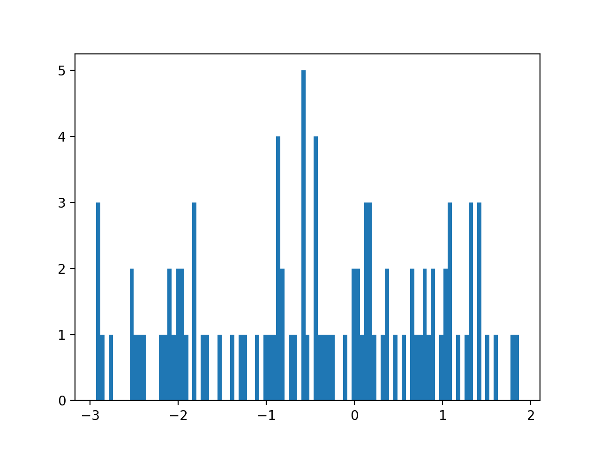
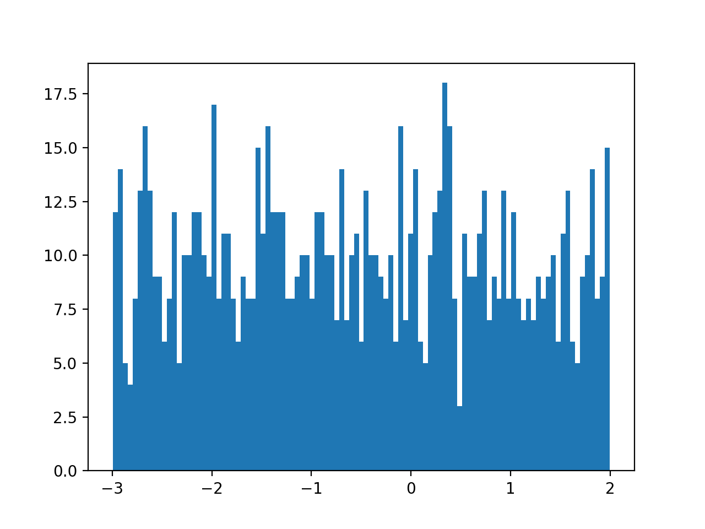
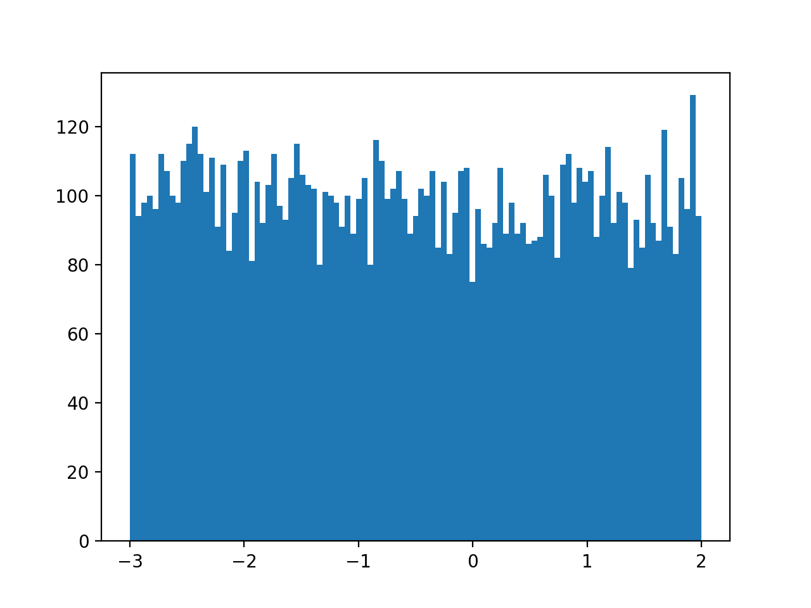
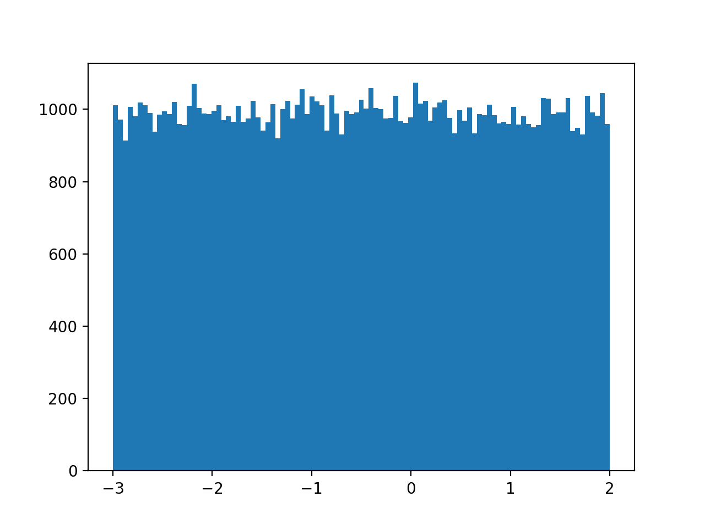
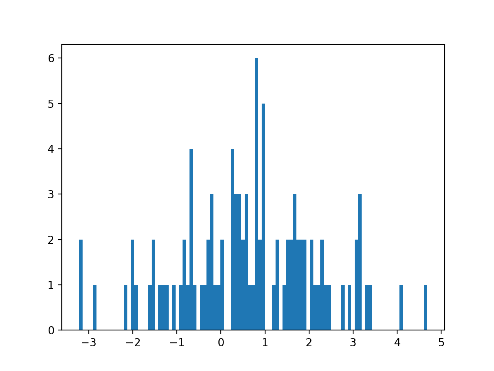
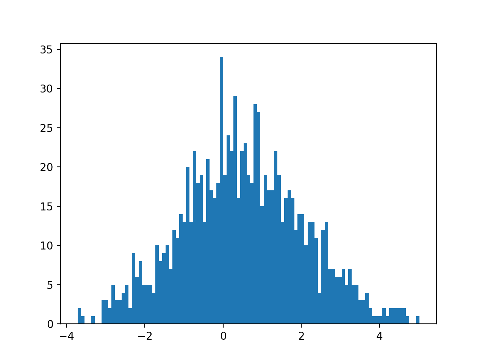
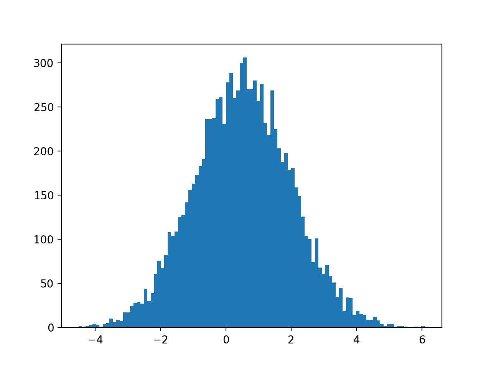
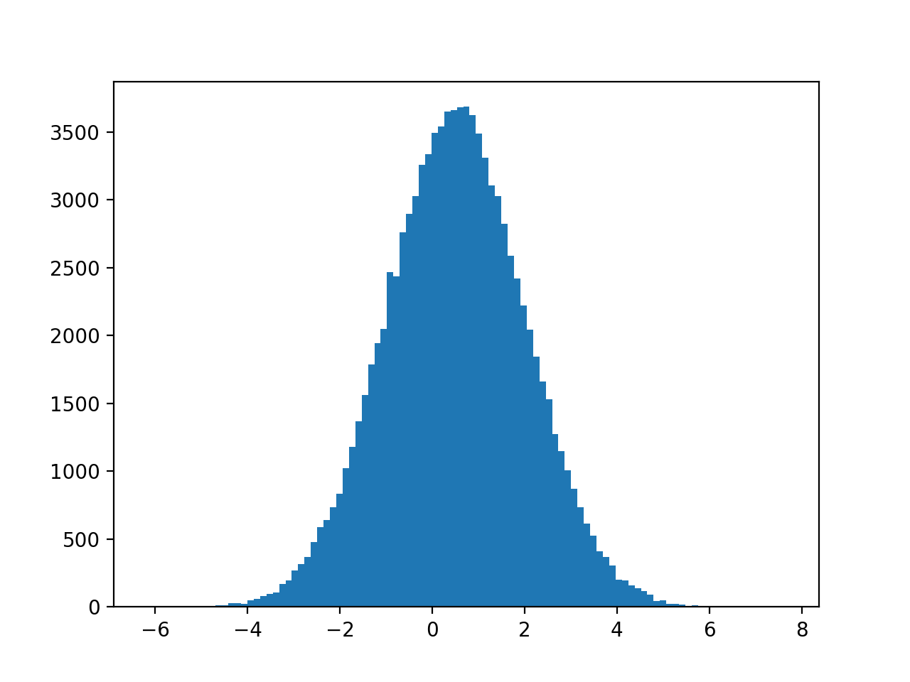

# Random Number Generator

## 실행방법
- main.c 에서 ran0.c ran1.c gasdev.c 를 사용하여 randome number generator를 구현하였습니다.
- main.c를 통해 ran0.c를 이용한 uniform distribution을 sample이 100, 1,000, 10,000, 100,000개 일때를 "random_number.csv"에 저장하였고
- ran1.c와 gasdev.c를 이용한 gaussian distribution을 sample이 100, 1,000, 10,000, 100,000개 일때를 "random_number.csv"에 저장하였습니다.
- 생성된 "random_number.csv"를 main.py에서 읽어 matplotlib를 이용하여 히스토그램을 생성하여 렌더링 하였습니다.
- ``` gcc main.c ran0.c ran1.c gasdev.c ```
- 위 명령어를 통해 c파일들을 컴파일하여 실행파일 "a.out"을 얻은 뒤
- ``` ./a.out ``` 을 실행하여 "random_number.csv"를 작성합니다.
- ``` python3 main.py ``` 를 실행하여 히스토그램을 얻습니다.
- 얻은 히스토그램은 main.py를 실행하면 함께 볼 수 있고 "README.md"문서와 함께 업로드한 png파일에서 볼 수 있습니다.
- 업로드한 png파일은 현재의 "random_number.csv"를 기반으로 그려진 것이기 때문에 새로 c파일을 컴파일하여 a.out을 실행 한 뒤의 결과와 달라집니다.
---
## 코드 설명
- uniform distribution
    - ran0.c 함수를 이용하여 [0,1] 구간의 random number를 얻은 뒤
    - 5를 곱하고, -3.0을 빼 주어 [-3,2]구간의 uniform distribution을 따르는 sample들을 얻어내었습니다.
- gaussian distribution
    - ran1.c를 사용하는 gasdev.c를 사용하여 정규분포 N(0,1)를 따르는 sample을 얻은 뒤
    - 얻은 sample에 1.5를 곱하고, 0.5를 더하여 정규분포 N(0.5,1.5)를 따른는 sample들을 얻어냈습니다.
- 위 과정을 각각의 방식에 대해 sample의 수를 100, 1000, 10000, 100000개로 늘려가며 실행하였습니다.

---
## Discuss the shape fo the histograms in terms of the number of samples. Refer Ch. 7, NR in C.
- uniform distribution과 gaussian distribution에서 모두 sample의 수가 적을 때에는 확률밀도함수와의 오차가 컸습니다.
- sample의 개수가 커 질수록 확률밀도함수와 근사해 가는 경향을 보였습니다.
---
## 히스토그램
### Uniform_Distribution_100

### Uniform_Distribution_1000

### Uniform_Distribution_10000

### Uniform_Distribution_100000


### Gaussian_Distribution_100

### Gaussian_Distribution_1000

### Gaussian_Distribution_10000

### Gaussian_Distribution_100000

